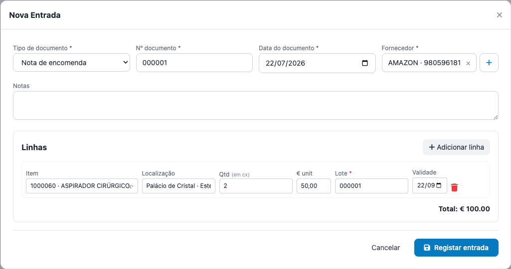

# Registar uma entrada

## Objetivo
Dar entrada de materiais de **consumo** recebidos (com base num documento fiscal), aumentando o **stock** e atualizando o **custo médio (CMP)**. Uma entrada pode ter **vários itens** (várias linhas).

## Quem pode executar
Utilizadores com a permissão **entrada** (`inventory:entry`).

## Antes de começar
- O **fornecedor** deve existir (ou crie na hora pelo **+**);
- os **itens** devem estar cadastrados;
- tenha o **documento** (fatura/guia) à mão: número e data.

## Passo a passo
1. Menu **Consumo › Entrada** → **Nova entrada**.
2. Cabeçalho:
   - **Tipo de documento** (Fatura, Guia de remessa, Nota de encomenda, Outro), **Nº documento** e **Data do documento**;
   - **Fornecedor** (busca; ou **+** para cadastrar sem sair);
   - **Notas** (opcional).
3. **Linhas** — clique em **Adicionar linha** para cada material:
   - **Item** (busca por nome/código/categoria) e **Localização** de destino;
   - **Qtd** e **€ unit** (custo unitário);
   - **Lote** e **Validade**:
     - se o item **controla lote**, o **Lote é obrigatório** (marcado com `*`);
     - se **não controla**, o lote é **opcional** — pode preencher (fica rastreado) ou deixar em branco.
   
4. Confira o **Total** e clique em **Registar entrada**.

## Resultado esperado
- O **stock** de cada item aumenta na localização informada (no lote, se houver).
- O **Custo Médio (CMP)** é recalculado (média ponderada com o que já havia).
- Gera-se um **movimento de entrada** por linha, visível no **Histórico** e no **Kardex**.

## Atenção
- Se um item estava com **saldo negativo** (modo seeding), a entrada regulariza o saldo e o CMP passa a refletir o custo desta entrada.
- **Não é possível editar** uma entrada depois de registada (os movimentos são imutáveis). Para reverter, um **Admin** pode **inativar a entrada** (gera estornos).

## Erros comuns
| Mensagem | Causa | Solução |
|---|---|---|
| "Item X controla lote — número de lote é obrigatório (RN03)" | O item controla lote e a linha ficou sem lote | Informe o **Lote** dessa linha |
| "Documento já registado para este fornecedor" | Já existe uma entrada com o mesmo nº para o fornecedor | Confira se não é duplicado; use outro nº |
| A entrada falha inteira e nada é gravado | Alguma linha tem erro | A entrada é **atómica**: corrija a linha indicada e registe de novo |

## Como corrigir
Erro de quantidade/custo depois de registada: peça a um **Admin** para **inativar a entrada** (estorna tudo) e lance de novo, ou faça um **[Ajuste](../ajustes/corrigir-quantidade.md)**.

## Auditoria
Cada entrada e os movimentos ficam no **Histórico** e no **Kardex** do item (com utilizador e momento).

## Tarefas relacionadas
[Registar uma saída](registrar-saida.md) · [Controlar lotes (FEFO)](controlar-lotes.md) · [Fornecedores](../cadastros/fornecedores.md)

> **Controle:** versão do sistema 1.18+ · última validação 2026-07-22 · responsável: equipa de Inventário.
