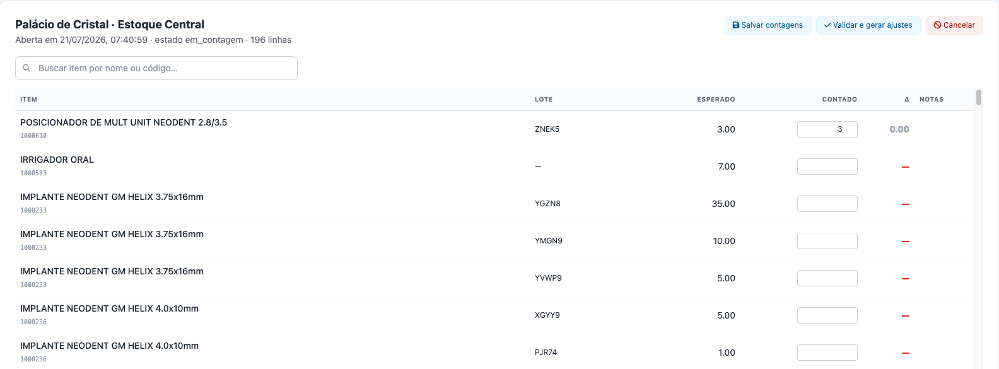

# Executar o inventário físico

## Objetivo
Conferir o stock **real** de uma localização contra o **saldo do sistema** e, no fim, **gerar automaticamente os ajustes** das diferenças encontradas.

## Quem pode executar
Utilizadores com a permissão de **sessão de inventário** (`inventory:inventory_session`).

## Antes de começar
Escolha a **localização (sublocal)** a contar. A sessão "fotografa" o saldo esperado de cada item/lote naquele local no momento da abertura.

## Passo a passo
1. Menu **Inventário Físico** → **Nova sessão** → escolha a **localização** e (opcional) notas → **Abrir sessão**.
2. A sessão abre no estado **em contagem**, listando cada **item/lote** com a coluna **Esperado**.
3. **Conte** fisicamente e digite o valor na coluna **Contado**. A coluna **Δ** mostra a diferença (verde = sobra, vermelho = falta).
   - Use a **busca** (por **nome, código ou lote**) para achar rapidamente um item numa lista grande. O filtro **preserva** o que já digitou.
   
4. Clique em **Salvar contagens** sempre que quiser guardar o progresso (pode voltar depois).
5. Quando terminar, clique em **Validar e gerar ajustes**.

## Resultado esperado
- Ao **validar**, o sistema **gera os ajustes** das diferenças (sobras e faltas), acertando o saldo do sistema ao contado.
- A sessão passa ao estado **validada**; os ajustes ficam no **Histórico**/**Kardex** de cada item.

## Atenção
- **Validar é definitivo** para a sessão — gera movimentos de ajuste. Confira as contagens antes.
- Uma sessão pode ser **Cancelada** (não gera ajustes) se foi aberta por engano.
- Itens sem contagem informada não geram ajuste (ficam como estavam).

## Erros comuns
| Situação | Causa | Solução |
|---|---|---|
| Não acha o item na lista longa | Sem filtro | Use a **busca** por nome/código/lote |
| Perdeu o que digitou ao filtrar | — | Não perde: o filtro só oculta/mostra. Ainda assim, **Salvar contagens** com frequência |
| Δ grande inesperado | Contagem ou saldo divergentes | Reconte; valide só quando estiver correto |

## Como corrigir
Enquanto **em contagem**, corrija os valores e salve. Depois de **validada**, correções seguem por [Ajustes](../ajustes/corrigir-quantidade.md).

## Auditoria
A sessão (aberta em, estado, contagens) e os ajustes gerados ficam registados; os movimentos aparecem no **Kardex** dos itens.

## Tarefas relacionadas
[Corrigir quantidades (Ajustes)](../ajustes/corrigir-quantidade.md) · [Relatórios e Kardex](../relatorios/relatorios-e-kardex.md)

> **Controle:** versão do sistema 1.18+ · última validação 2026-07-22 · responsável: equipa de Inventário.
