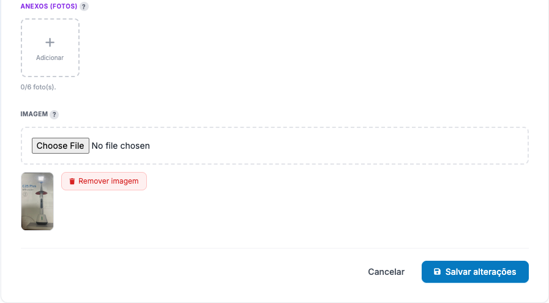

# Editar um item

## Objetivo
Alterar os dados de um item já cadastrado (nome, categoria, fabricante, parâmetros de stock, controle de lote, imagem e — no património — os anexos).

## Quem pode executar
Utilizadores com a permissão **editar item** (`inventory:update_item`). Alguns campos sensíveis (ex.: custo médio) são reservados ao perfil **Inventory_Admin**.

## Antes de começar
Saiba que **o tipo (Consumo/Património) e o código interno não mudam** — são definidos na criação.

## Passo a passo
1. **Itens** → localize o item (use a busca por nome/código) → clique no ícone de **editar** (lápis) ou abra a ficha e escolha **Editar**.
2. Ajuste os campos necessários.
3. **Controle de lote** — pode **marcar ou desmarcar** a caixa **"Este item controla lote / validade"** a qualquer momento, **mesmo que o item já tenha lotes lançados**:
   - Desmarcar **não apaga** os lotes existentes — apenas deixa de **exigir** o lote nas próximas entradas. O stock que está em lote **continua a ser consumido** normalmente (por FEFO). Ver [Controlar lotes](../consumo/controlar-lotes.md).
4. **(Património) Anexos (fotos)** — na secção **Anexos**, adicione até **6 fotos** (botão **+**) ou remova (ícone de lixo). As fotos aparecem na ficha.
   
5. Clique em **Salvar alterações**.

## Resultado esperado
Os novos dados passam a valer imediatamente. Mudar o **stock mínimo/máximo** afeta os alertas de "abaixo do mínimo". Mudar o **controle de lote** afeta a obrigatoriedade do lote nas próximas entradas/saídas.

## Atenção
- **Custo Médio (CMP)** não é editado à mão — ele é recalculado automaticamente pelas **entradas**.
- Desligar o controle de lote é seguro (não perde dados), mas pense se faz sentido: a partir daí as entradas podem não registar lote.

## Erros comuns
| Mensagem | Causa | Solução |
|---|---|---|
| "Campo 'cmp' só pode ser alterado por Inventory_Admin…" | Tentou alterar um campo reservado | O CMP é gerido pelas entradas; peça a um Admin se for mesmo necessário |
| "A categoria selecionada possui subcategorias…" | Trocou para uma categoria-pai | Escolha uma categoria final |

## Como corrigir
Reabra o item e ajuste. Para corrigir **quantidades em stock**, não é aqui — use [Ajustes](../ajustes/corrigir-quantidade.md).

## Auditoria
Cada edição fica registada (utilizador + momento) no **Log de Acesso**.

## Tarefas relacionadas
[Cadastrar um item](cadastrar-item.md) · [Consultar a ficha](consultar-ficha.md) · [Corrigir quantidades](../ajustes/corrigir-quantidade.md)

> **Controle:** versão do sistema 1.18+ · última validação 2026-07-22 · responsável: equipa de Inventário.
