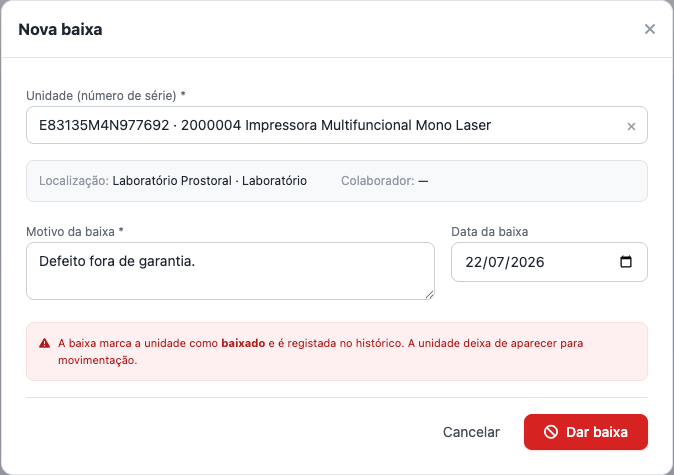

# Dar baixa numa unidade de património

## Objetivo
Retirar definitivamente uma unidade de património do uso (venda, descarte, perda, fim de vida). A baixa é **irreversível**.

## Quem pode executar
Utilizadores com a permissão **saída** (`inventory:exit`).

## Antes de começar
Confirme **qual unidade** (número de série) será baixada e o **motivo**. Uma vez baixada, a unidade **não pode mais ser movimentada nem reativada**.

## Passo a passo
1. Menu **Património › Saída** → **Nova baixa**.
2. Escolha a **unidade** a baixar (busca por número de série/item).
3. Informe o **motivo** da baixa (obrigatório para rastreio) e, se aplicável, a data.
   
4. Confirme.

## Resultado esperado
- A unidade passa ao estado **baixado** e deixa de contar como ativa (some das listas de movimentação).
- Gera-se um **movimento de baixa** no **Histórico**.

## Atenção
- **Operação irreversível:** a unidade baixada **não volta** e **não pode ser movimentada**.
- A baixa é **por unidade** — não afeta as outras unidades do mesmo item.
- Baixa **não é depreciação**: depreciar reduz o **valor**; baixar **encerra** o ativo.

## Erros comuns
| Situação | Causa | Solução |
|---|---|---|
| A unidade não aparece para baixa | Já está **baixada** | Uma unidade só pode ser baixada uma vez |
| Confundir com depreciação | Objetivo diferente | Para reduzir valor no fim do ano, use **[Depreciação](executar-depreciacao.md)** |

## Como corrigir
A baixa é definitiva. Se foi um engano, será necessário **cadastrar novamente** a unidade por uma nova **[aquisição](cadastrar-aquisicao.md)** (com nova série) — e registar a correção conforme a política interna.

## Auditoria
O movimento de baixa (com motivo, utilizador e momento) fica no **Histórico**.

## Tarefas relacionadas
[Executar a depreciação](executar-depreciacao.md) · [Movimentar um equipamento](movimentar-equipamento.md)

> **Controle:** versão do sistema 1.18+ · última validação 2026-07-22 · responsável: equipa de Património.
