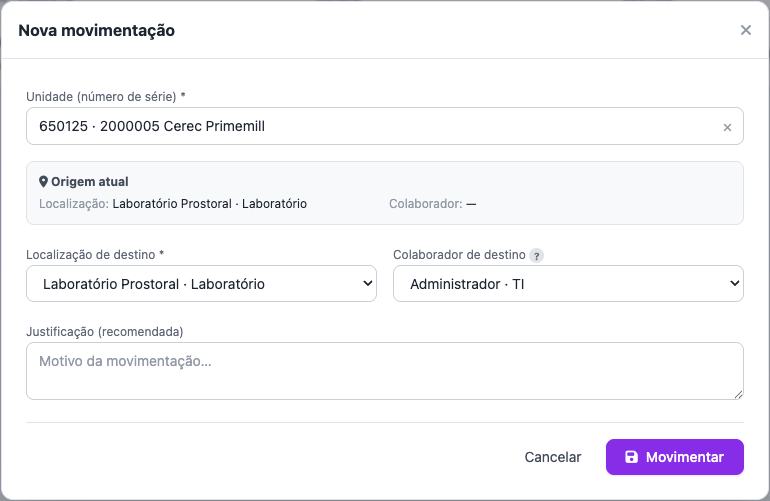

# Movimentar um equipamento

## Objetivo
Registar a **movimentação** de uma unidade de património — mudança de **localização** e/ou de **colaborador** responsável. Ao contrário do consumo, o património move-se **unidade a unidade** (não por quantidade).

## Quem pode executar
Utilizadores com a permissão **transferência** (`inventory:transfer`).

## Antes de começar
A unidade (número de série) deve estar **ativa** (não baixada). Tenha em mente o **destino**: nova localização e/ou novo colaborador.

## Passo a passo
1. Menu **Património › Movimentação** → **Nova movimentação**.
2. Escolha a **unidade** (busca por número de série ou item).
3. Informe o **destino** — pode alterar **a localização, o colaborador, ou ambos**:
   - **Localização de destino** (para onde vai o bem);
   - **Colaborador de destino** (quem passa a ser responsável).
   
4. Adicione uma **justificação** (recomendada) e confirme.

## Resultado esperado
A unidade passa a ter a **nova localização e/ou colaborador** atuais. Gera-se um **movimento** de movimentação, com origem e destino (localização/colaborador), no **Histórico**.

## Atenção
- Só se movimenta uma unidade **ativa**. Unidade **baixada** não pode ser movimentada.
- Não é uma transferência de quantidade — é o **deslocamento de um ativo específico**.

## Erros comuns
| Situação | Causa | Solução |
|---|---|---|
| A unidade não aparece para movimentar | Está **baixada** ou inativa | Só unidades ativas movimentam; verifique o estado na ficha |
| Destino igual à origem | Não houve mudança | Escolha uma localização e/ou colaborador diferente |

## Como corrigir
Movimentação errada: faça uma **nova movimentação** de volta à localização/colaborador anteriores.

## Auditoria
O histórico de movimentações da unidade fica no **Histórico** e na ficha do item (unidades).

## Tarefas relacionadas
[Atribuir a um colaborador](atribuir-colaborador.md) · [Dar baixa numa unidade](dar-baixa.md) · [Cadastrar uma aquisição](cadastrar-aquisicao.md)

> **Controle:** versão do sistema 1.18+ · última validação 2026-07-22 · responsável: equipa de Património.
