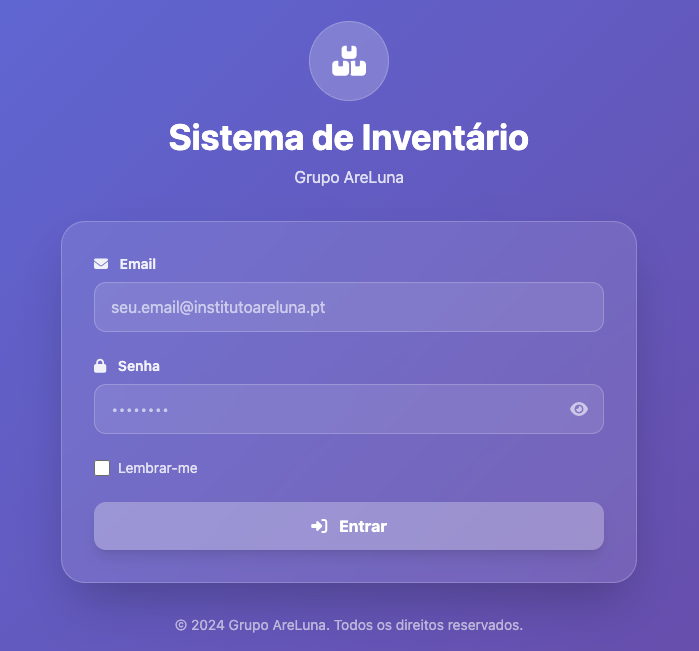
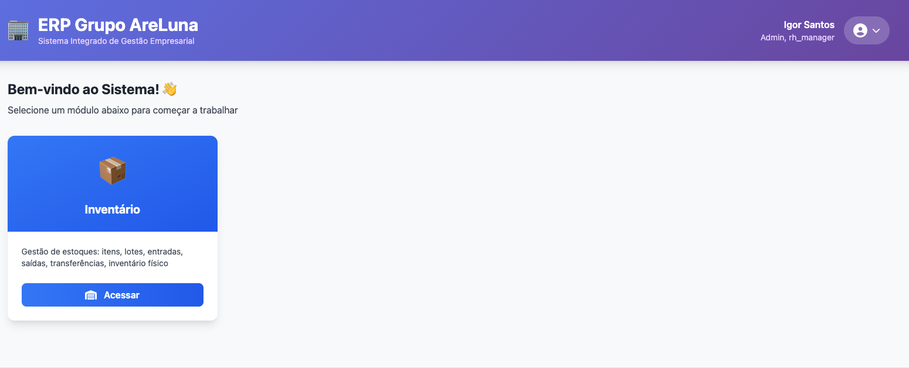
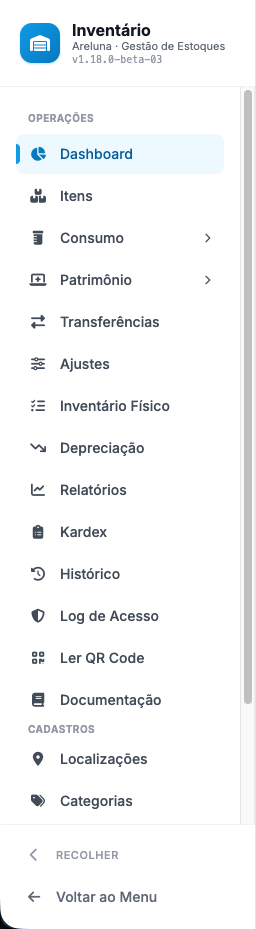

# Primeiros passos

## Objetivo
Apresentar o módulo Inventory a quem está a começar: como entrar, como navegar e onde estão as tarefas principais.

## Entrar no sistema
1. Aceda ao endereço do ERP e faça **login** com o seu utilizador (email e palavra-passe).
   
2. Abra o módulo **Inventário**.
   

> **Sessão:** perto de expirar, aparece um aviso **"Sua sessão vai expirar — continuar conectado?"**. Clique em **Continuar conectado** para renovar **sem perder o trabalho**.
>
> **Palavra-passe:** o sistema pode pedir a **troca de palavra-passe** periodicamente.

## Navegação
A barra lateral organiza o módulo em grupos:
- **Dashboard** — visão geral e alertas.
- **Itens** — o catálogo (com a coluna **Stock** = saldo atual; **vermelho** = abaixo do mínimo).
- **Consumo** — Entrada e Saída.
- **Património** — Entrada, Movimentação e Saída.
- **Transferências**, **Ajustes** (Admin), **Inventário Físico**, **Depreciação**.
- **Relatórios**, **Kardex**, **Histórico**, **Log de Acesso**.
- **Ler QR Code** e a **Documentação**.
- **Cadastros** — Localizações, Categorias, Fornecedores, Fabricantes, Unidades de medida.
   

**Dicas de produtividade:**
- Há uma **busca global** no topo (item, lote, fornecedor).
- Nas listas e formulários, os campos de escolha têm **busca** (digite parte do nome/código).
- Um item de menu pode ser aberto em **nova aba** com o **clique do meio** (roda do rato).

## O Dashboard
Mostra indicadores rápidos: itens abaixo do mínimo, lotes a vencer, valor de inventário e atalhos para as tarefas mais comuns.

## Por onde começar (tarefas frequentes)
1. [Cadastrar um item](itens/cadastrar-item.md)
2. [Registar uma entrada](consumo/registrar-entrada.md)
3. [Registar uma saída](consumo/registrar-saida.md)
4. [Transferir materiais](consumo/transferir-materiais.md)
5. [Cadastrar/movimentar património](patrimonio/cadastrar-aquisicao.md)
6. [Executar o inventário físico](inventario-fisico/executar-contagem.md)

## Atenção
- **Enter** dentro de um formulário **não salva** o registo (evita envios acidentais) — use o **botão** Salvar/Registar.
- O que cada utilizador pode fazer depende do seu **perfil** — ver [Perfis e permissões](perfis-e-permissoes.md).

## Tarefas relacionadas
[Perfis e permissões](perfis-e-permissoes.md) · [Glossário](glossario.md) · [Erros comuns](resolucao-de-problemas/erros-comuns.md)

> **Controle:** versão do sistema 1.18+ · última validação 2026-07-22 · responsável: equipa de Inventário.
